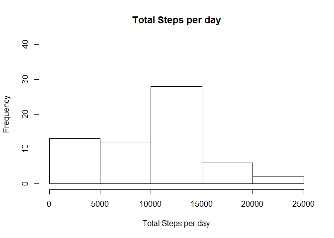
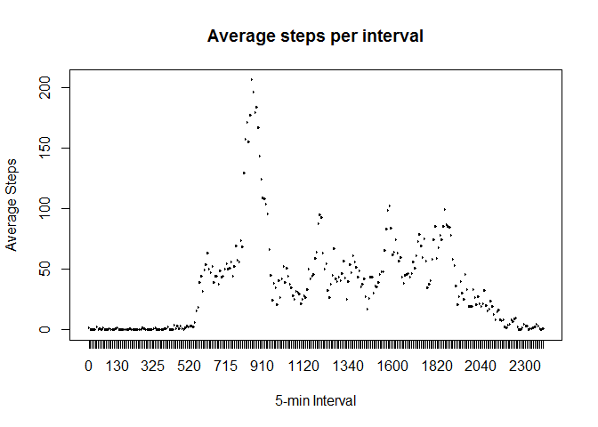
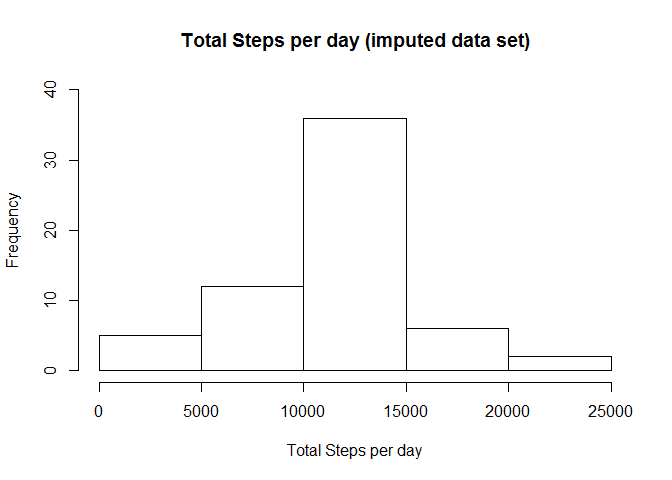
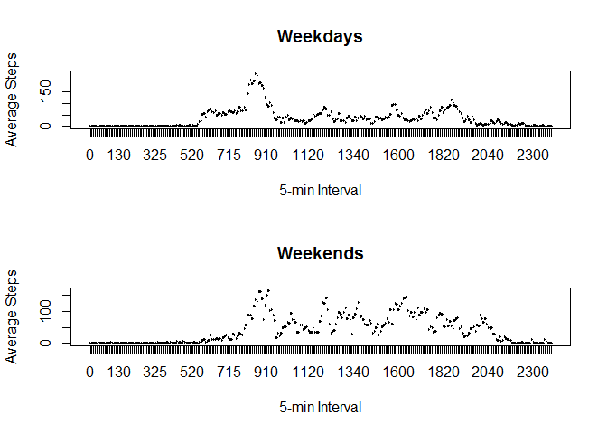

# Reproducible Research: Peer Assessment 1

## Loading and preprocessing the data

First, we load the libraries and data:

```r
library(dplyr)
```

```
## 
## Attaching package: 'dplyr'
```

```
## The following objects are masked from 'package:stats':
## 
##     filter, lag
```

```
## The following objects are masked from 'package:base':
## 
##     intersect, setdiff, setequal, union
```

```r
data <- read.csv("activity.csv")
```

We then transform the data:

```r
#transform dates
data$date <- as.Date(as.character(data$date),"%Y-%m-%d")
```

We calculate the total number of steps taken per day:

```r
#sum dates per day
stepsbydate <- summarize(group_by(data,date),total.steps=sum(steps,na.rm=TRUE))
```

Here are the total number of steps taken per day, as a table and histogram:

```r
#print table
print(stepsbydate)
```

```
## # A tibble: 61 x 2
##          date total.steps
##        <date>       <int>
##  1 2012-10-01           0
##  2 2012-10-02         126
##  3 2012-10-03       11352
##  4 2012-10-04       12116
##  5 2012-10-05       13294
##  6 2012-10-06       15420
##  7 2012-10-07       11015
##  8 2012-10-08           0
##  9 2012-10-09       12811
## 10 2012-10-10        9900
## # ... with 51 more rows
```

```r
#plot histogram
hist(stepsbydate$total.steps,xlab="Total Steps per day",ylim=c(0,40),main="Total Steps per day")
```

<!-- -->

## What is mean total number of steps taken per day?

Here are the mean and median of the total number of steps taken per day:

```r
#calculate mean steps per day
meansteps <- mean(stepsbydate$total.steps,na.rm=TRUE)
print(meansteps)
```

```
## [1] 9354.23
```

```r
#calculate median steps per day
mediansteps <- median(stepsbydate$total.steps,na.rm=TRUE)
print(mediansteps)
```

```
## [1] 10395
```

## What is the average daily activity pattern?

Here is the average daily activity pattern:

```r
#average steps per interval
data$interval <- factor(data$interval)
stepsbyint <- summarize(group_by(data,interval),mean.steps=mean(steps,na.rm=TRUE))

#time series plot
with(stepsbyint,
  plot(interval, mean.steps,xlab="5-min Interval",ylab="Average Steps",main="Average steps per interval",type="l")
)
```

<!-- -->

Here is the 5-min interval containing the maximum number of steps:

```r
intervalmaxsteps <- stepsbyint[which(stepsbyint$mean.steps==max(stepsbyint$mean.steps)),1]
print(intervalmaxsteps)
```

```
## # A tibble: 1 x 1
##   interval
##     <fctr>
## 1      835
```

## Imputing missing values

Here is the total number of missing values in the original dataset:

```r
sum(is.na(data))
```

```
## [1] 2304
```

We will create a new dataset after imputing missing values by using the mean for that interval:

```r
#for every NA steps, impute using mean for that interval
datanew <- data
for(i in 1:nrow(data)) {
  if (is.na(data[i,1])) {
    datanew[i,1] <- stepsbyint[stepsbyint$interval==data[i,3],2]
  }
}
```

Here's a histogram of the total number of steps taken per day:

```r
#sum dates per day
stepsbydatenew <- summarize(group_by(datanew,date),total.steps=sum(steps,na.rm=TRUE))

#plot histogram
hist(stepsbydatenew$total.steps,xlab="Total Steps per day",ylim=c(0,40),main="Total Steps per day (imputed data set)")
```

<!-- -->

Here are the mean and median of the total number of steps taken per day:

```r
#calculate mean steps per day
meanstepsnew <- mean(stepsbydatenew$total.steps,na.rm=TRUE)
print(meanstepsnew)
```

```
## [1] 10766.19
```

```r
#calculate median steps per day
medianstepsnew <- median(stepsbydatenew$total.steps,na.rm=TRUE)
print(medianstepsnew)
```

```
## [1] 10766.19
```

We can see that the mean and median are slightly different after imputation.

The distribution of the total daily number of steps is no longer skewed since the mean is equal to the median.

## Are there differences in activity patterns between weekdays and weekends?

We create a factor variable indicating weekend vs weekday.


```r
weekendArray <- c("Sat","Sun")

for(i in 1:nrow(datanew)) {
  if (weekdays(datanew[i,2],abbreviate=TRUE) %in% weekendArray) {
    datanew[i,4] <- "weekend"
  }
  else {
    datanew[i,4] <- "weekday"
  }
}

#factorize daytype
datanew$V4 <- factor(datanew$V4)
names(datanew)[4] <- "daytype"
```

Here is a time series plot of the average number of steps taken, averaged across all weekday days or weekend days.


```r
#average steps per interval
datanew$interval <- factor(datanew$interval)
stepsbyintnew <- summarize(group_by(datanew,interval,daytype),mean.steps=mean(steps,na.rm=TRUE))

#time series plot
par(mfrow=c(2,1))
with(stepsbyintnew,{
  plot(interval[daytype=="weekday"], mean.steps[daytype=="weekday"],xlab="5-min Interval",ylab="Average Steps",main="Weekdays",type="l")
  plot(interval[daytype=="weekday"], mean.steps[daytype=="weekend"],xlab="5-min Interval",ylab="Average Steps",main="Weekends",type="l")
  }
)
```

<!-- -->

You can see that there is increased activity between approximately the 1120 and 2040 intervals during weekends as compared to weekdays.
